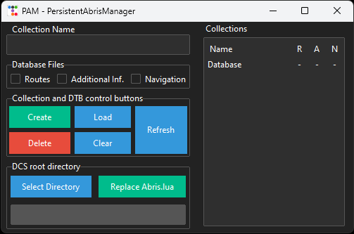
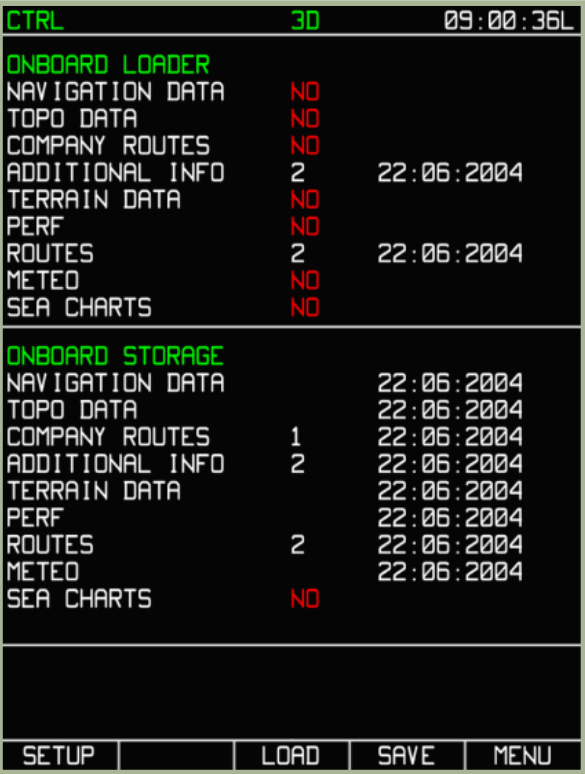
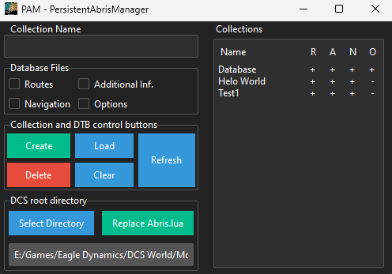

<h1>Description</h1>
  PersistentAbris is a solution to the problem of losing all your routes, additional info and nav data in the Ka-50 when leaving a mission or server.
  
  The solution to making all the routes and map info persistent across missions is to modify the ABRIS.lua file, which is responsible for saving and loading said data, so that is saves all the data to a set of files in a location in the SavedGames DCS directory, where it will also read them from. From testing, this does not appear to break the integrity check, so you should be able to fly on any server.
  
  <b>Note: Currently, if a mission has baked in abris data, your persistent files will not be loaded for that mission. I have tried a couple of ways of getting around this issue, but have yet to find a solution</b>
  
  With just the steps described above, you would have a single set of files containing all your routes, additional info and nav data, which would accumulate quite a collection given enough time. Given that you would probably want to avoid having a massive amount of routes and possibly conflicting or inaccurate map elements, I have developed a manager app to work alongside the modified ABRIS.lua file. Keep in mind that you do not need the manager app for the persistent data to work, only to manage what you load and save in an easier fassion.

<h1>Installation</h1>
As said before, you will need to do two things to make PersistentAbris work: overwrite the ABRIS.lua file with the modified version and make a certain folder structure inside the SavedGames DCS directory.

There are two ways of doing this:
<ol>
  <li>Manualy</li>
  <li>Via the manager app (Recommended)</li>
</ol>

<h3>Manual method</h3>
<ol>
  <li>Download the modified ABRIS.lua file from the repository above</li>
  <li>Repalce the original ABRIS.lua file in "[your dcs root directory]/Mods/aircraft/Ka-50_3/Cockpit/Scripts/Devices_specs/" with the downloaded one (feel free to save the original file somewhere)</li>
  <li>In the SavedGames DCS directory make a folder called PersistentAbris, inside it a folder call ABRIS, and inside it a folder called Database. 
      You should end up with this folder structure inside the SavedGames directory: PersistentAbris/ABRIS/Database </li>
   
  Those are the bare minimum steps to get PersistentAbris working, you should be able to save and load you data now.  
  <b>You can find information about saving and loading data in the "How to use" section below</b>
</ol>

<h3>PersistentAbrisManager method</h3>
<ol>
  <li>Download the lates release of the manager app (PersistentAbrisManager.zip)</li>
  <li>Unzip the downloaded archive directly into the SavedGames DCS directory</li>
  <li>Open the PersistentAbris folder that was created after unziping and launch PersistentAbrisManager.exe</li>
  <li>To replace the ABRIS.lua file, we will focus on the bottom left section of the app titled: DCS root directory 
       
      </img>
       
      Press the "Select Directory" button. 
      This will bring up a folder seletion interface. Simply navigate to the root directory of your DCS instalation ( The folder you select will likely be called DCS World ) 
      After doing so, providing you selected the correct folder, the text box below the button should be populated with the full path to the folder in which ABRIS.lua is located. 
      The full path won't fit inside the allocated display space, but if it is showing a path, then it is the correct one as the app checks if the path exists. 
      </img> 
      If the path is valid, it will also be saved in a .txt file inside the PersistentAbris directory and it will be loaded from there on any future launches of the manager app
  </li>
  <li>
      Having slected the path, simply press the "Replace ABRIS.lua" button. 
      It will create a copy of the ABRIS.lua file in the same directory it was found in (it will be renamed to ABRIS_old.lua) and copy the modified file in its place. 
      Keep in mind that the ABRIS_old.lua will not be overwritten if it already exists. If ED updates the ABRIS.lua file at some point, you will need to delete the ABRIS_old.lua to make sure it gets backedup when replacing the file again.
  </li>
</ol>

<h1>How to use</h1>
<h3>Saving data in game</h3>
  <ol>
    <li>To save any routes in game, you will first need to save and name them using the PLAN page of the Abris.</li>
    <li>Navigate to the MENU/CONTROL/DTB page of the abris.
         
        </img>
         
    </li>
    <li>Press the SAVE button and use the rotary knob or the arrow buttons to navigate to the data you want to save. 
        <ul>  
          <li>Pressing SAVE on NAVIGATIONAL DATA will save navigation points and map objects and other navigation information</li> 
          <li>Pressing SAVE on ADDITIONAL INFO will save Point and Line objects entered by user</li> 
          <li>Pressing SAVE on ROUTES will save routes entered by user</li>
        </ul>
    </li>
  </ol>
  The mentioned data will be stored into corresponding files inside the ABRIS/Database directory:
  <ul>
      <li>ROUTES.lua</li>
      <li>ADDITIONAL.lua</li>
      <li>NAVIGATION.lua</li>
    </ul>
  <b>Note: the DTB page of the Abris has a use in vanila DCS as well, though not many people seem to know that. You can save all the mentioned data while in a mission or server, in the sense that when you die or respawn in that mission, the data doesn't get lost. It just doesn't provide the ability for that data to persist across missions, so reloading the mission or leaving the server deleted the data</b>
  
<h3>Loading data in game</h3>
  The loading of the data is automatic. 
  When you spawn in a Ka-50, the data stored in the "ABRIS/Database" folder will be loaded into the Abris. 
  With that in mind, you can change the data you have loaded in your abris during a mission by respawning. This is achived by moving the wanted data files into the Database folder.

<h3>PersistentAbrisManager</h3>
  </img> 
  We will analyse all aspects of the manager app, apart from the "DCS root directory" section, as it was covered in the installation process. 

  <h4>Working principle of the app</h4>
    The manager is designed to allow you to easily make different collections of Abris data. 
    The data consists of the three file mentioned in the Saving section above. 
    By moving those files in and out of the ABRIS/Database folder, they can be loaded in game or stored in a different directory for later use.
    All the app does is it creates collections which consist of the abris data files by way of making folders in the "ABRIS/" directory and copying files between those folders and the Database folder. 
    Collections don't have to consist of all the data files, but rather can be partial collections having only one or two of the files.
    
  <h4>Collection name input field</h4>
    The collection name field is used to indicate which collection you want to work with. 
    By typing the name of a collection that does not exist in this field, you will be able to create a collection with that name. 
    By typing the name of a collection that does exist, you will be able to modify it, load data from it, delete data from it or delete the collection itself. 
    Trying to type "Database" into the input field, the field will get cleared of all input as modifing the Database in that way would cause problems.

  <h4>Database Files</h4>
    This section consists of 3 check boxes which let you choose which files you want to manipulate.

  <h4>Collection and DTB control buttons</h4>
    This sections consists of 5 buttons used to manipulate the Database and the collections: 
      <ul>
        <li>
          <b>Create</b> 
          This button allows you to create a collection with the name inserted into the "Collection Name" field. 
          To create a collection, it will copy files from the Database folder into a folder with the same name as the collection. 
          The check boxes will determine which files get copied to the collection.  
          In case that the name of a collection that already exists is input into the "Collection Name" field, the button will read "Update" instead of "Create". 
          The functionality will remain identical, the press of the button will move selected files from the Database folder into the corresponding collection folder. 
          Keep in mind that updating a collection with new files will override the files currently in it.
        </li>
        <li>
          <b>Delete</b> 
          This button allows you to delete files from collections, or to delete collections themselves. 
          Choosing which collection to delete from is done via the "Collection Name" field. If the name entered into said field isn't a existing collection, nothing will happen upon clicking the button.
          In case that a collection has files in itself, the delete function will delete files from the collection. 
          The check boxes determine which files get deleted.  
          In case that the collection is empty, pressing the Delete button will delete the collection. 
          The check boxes are irrelevant in this case
        </li>
        <li>
          <b>Load</b> 
          This button copies files from the selected collection into the Database folder. 
          The check boxes determine which files get loaded. 
          Any loaded files will overwrite the files in the Database folder, destroying any unsaved data. 
          This button will do nothing if the selected database does not exist or is empty
        </li>
        <li>
          <b>Clear</b> 
          This button deletes files from the Database folder. 
          The check boxes determine which files get deleted. 
        </li>
        <li>
          <b>Refresh</b> 
          This button refreshes the Collections display on the right side of the app. Only needed if manualy editing the files or folder structure.
        </li>
      </ul>
      
  <h4>Collections display</h4>
    This sections displays all the collections, along side the Database, and shows which files they contain within them. 
    <ul>
        <li>R -> Routes</li>
        <li>A -> Additional Info</li>
        <li>N -> Navigation Data</li>
    </ul>
    A '+' indicates that the corresponding file exists and a '-' indicates that the file does not exist within the collection/database. 
    Double clicking on any of the collections within the display will copy their name to the "Collection Name" input field
